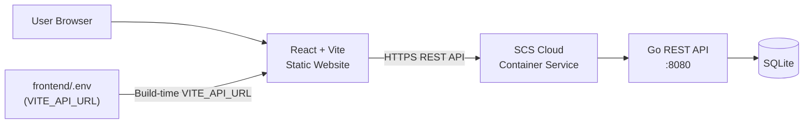

# TaskFlow

> TaskFlow is a demonstration full-stack application created to showcase deployment of a React + Vite static frontend and a containerized Go REST API on **SCS Cloud**.

A small, purposefully simple task manager built to be easy to clone, run, understand, and explain in an interview or demo.

---

## Demo

| Service | URL |
|---------|-----|
| Frontend | `https://YOUR_SCS_FRONTEND_URL` |
| Backend health | `https://YOUR_SCS_BACKEND_URL/api/health` |

> Update these URLs after deployment.

---

## Why This Project

This is **intentionally a small application**. The goal is not to build the world's best task manager — it is to demonstrate:

- Static website deployment (React + Vite → SCS Cloud Static Website)
- Container deployment (Go API → SCS Cloud Container Service)
- Frontend-to-backend REST API communication
- CORS configuration across separately hosted services
- Environment variable configuration for both frontend and backend
- SQLite database integration inside a Docker container
- Multi-stage Docker builds
- A clean, responsive UI written with plain CSS

---

## Features

- Create tasks with a title and optional description
- View all tasks in a list
- Complete / undo tasks
- Delete tasks with confirmation
- Filter by All / Active / Completed with live counts
- Live backend connectivity indicator (polls `GET /api/health`)
- Loading, empty, and error states
- Fully responsive layout (375 px → 1440 px+)

---

## Tech Stack

| Layer | Technology |
|-------|-----------|
| Frontend | React 18, Vite 5, plain CSS Modules |
| Backend | Go 1.22, `net/http` (stdlib only) |
| Database | SQLite via `go-sqlite3` |
| Container | Docker (multi-stage Alpine build) |
| Deployment | SCS Cloud Static Website + Container Service |

---

## Architecture



The frontend is a **static site** — the API URL is baked in at Vite build time. The backend is a **stateful container** that owns the SQLite database.

---

## Project Structure

```
taskflow/
├── frontend/
│   ├── public/
│   │   └── favicon.svg
│   ├── src/
│   │   ├── api/
│   │   │   ├── client.js       ← single source of truth for BASE_URL
│   │   │   └── tasks.js        ← typed wrappers for each endpoint
│   │   ├── components/
│   │   │   ├── Header.jsx / .module.css
│   │   │   ├── TaskForm.jsx / .module.css
│   │   │   ├── TaskFilters.jsx / .module.css
│   │   │   ├── TaskList.jsx / .module.css
│   │   │   └── TaskItem.jsx / .module.css
│   │   ├── hooks/
│   │   │   ├── useTasks.js     ← all task state and mutations
│   │   │   └── useHealth.js    ← backend ping poll
│   │   ├── App.jsx / .module.css
│   │   ├── index.css           ← design tokens + global reset
│   │   └── main.jsx
│   ├── .env                    ← committed (public VITE_API_URL only)
│   ├── .env.example
│   ├── index.html
│   ├── package.json
│   └── vite.config.js
│
├── backend/
│   ├── cmd/server/
│   │   └── main.go             ← entry point, router, middleware
│   ├── internal/
│   │   ├── config/config.go    ← env var loading
│   │   ├── database/
│   │   │   ├── database.go     ← open + migrate
│   │   │   └── tasks.go        ← SQL queries
│   │   ├── handlers/
│   │   │   ├── handlers.go     ← all HTTP handlers
│   │   │   └── handlers_test.go
│   │   └── models/task.go      ← domain types
│   ├── .env.example
│   ├── Dockerfile
│   ├── go.mod
│   └── go.sum
│
├── docker-compose.yml
├── .gitignore
└── README.md
```

---

## Prerequisites

| Tool | Version |
|------|---------|
| Node.js | 18+ |
| Go | 1.22+ |
| Docker | 24+ (optional for local API) |
| GCC / build-essential | Required for `go-sqlite3` CGO |

> On Windows, install [TDM-GCC](https://jmeubank.github.io/tdm-gcc/) or use WSL to satisfy the CGO requirement.

---

## Local Development

### 1. Clone the repository

```bash
git clone https://github.com/YOUR_USER/taskflow.git
cd taskflow
```

### 2. Run the backend

**Option A — Docker (recommended, no Go required):**

```bash
docker compose up --build
# API available at http://localhost:8080
```

**Option B — Go directly:**

```bash
cd backend
go mod download
go run ./cmd/server
# API available at http://localhost:8080
```

Verify the API is running:

```bash
curl http://localhost:8080/api/health
# {"service":"taskflow-api","status":"ok"}
```

### 3. Run the frontend

```bash
cd frontend
npm install
npm run dev
# App available at http://localhost:5173
```

Open [http://localhost:5173](http://localhost:5173) in your browser.

---

## Environment Variables

### Frontend — `frontend/.env`

```env
VITE_API_URL=http://localhost:8080
```

| Variable | Description |
|----------|-------------|
| `VITE_API_URL` | Base URL of the Go REST API |

**Why is `frontend/.env` committed?**

Vite replaces `import.meta.env.VITE_*` values **at build time**, not at runtime. The resulting JavaScript bundle contains the literal URL string. Because SCS Cloud Static Website runs `npm run build` in CI, it needs the `.env` file present in the repository to embed the correct backend URL.

> ⚠️ **Security rule:** Only public values may go in `frontend/.env`. The URL is already visible to anyone who reads the JS bundle — that is fine. Never put passwords, API secrets, or tokens here.

### Backend — configure via environment or `.env.example`

```env
PORT=8080
DB_PATH=./data/taskflow.db
CORS_ORIGIN=http://localhost:5173
```

| Variable | Default | Description |
|----------|---------|-------------|
| `PORT` | `8080` | Port the API listens on |
| `DB_PATH` | `./data/taskflow.db` | Path to the SQLite database file |
| `CORS_ORIGIN` | `http://localhost:5173` | Allowed frontend origin |

Copy `.env.example` to `.env` for local development:

```bash
cp backend/.env.example backend/.env
```

> The backend `.env` is **not committed** — configure production values directly in the SCS Cloud Container Service environment variable settings.

---

## API Documentation

Base URL: `http://localhost:8080` (local) or `https://YOUR_SCS_BACKEND_URL` (production)

### `GET /api/health`

Check backend connectivity.

**Response `200 OK`:**
```json
{ "status": "ok", "service": "taskflow-api" }
```

---

### `GET /api/tasks`

Retrieve all tasks, ordered by creation date descending.

**Response `200 OK`:**
```json
[
  {
    "id": 1,
    "title": "Deploy TaskFlow",
    "description": "Deploy the application on SCS Cloud",
    "completed": false,
    "created_at": "2026-09-12T10:00:00Z",
    "updated_at": "2026-09-12T10:00:00Z"
  }
]
```

---

### `POST /api/tasks`

Create a new task.

**Request body:**
```json
{ "title": "Deploy backend", "description": "Optional detail" }
```

**Response `201 Created`:** The created task object.

**Response `400 Bad Request`** if title is empty:
```json
{ "error": "Task title is required" }
```

---

### `PUT /api/tasks/:id`

Update a task's completed state.

**Request body:**
```json
{ "completed": true }
```

**Response `200 OK`:** The updated task object.

**Response `404 Not Found`** if the task does not exist.

---

### `DELETE /api/tasks/:id`

Delete a task permanently.

**Response `200 OK`:**
```json
{ "message": "Task deleted" }
```

**Response `404 Not Found`** if the task does not exist.

---

## Running with Docker

### Build the image

```bash
docker build -t taskflow-api ./backend
```

### Run the container

```bash
docker run -p 8080:8080 \
  -e PORT=8080 \
  -e DB_PATH=/app/data/taskflow.db \
  -e CORS_ORIGIN=http://localhost:5173 \
  -v taskflow_data:/app/data \
  taskflow-api
```

### Compose (recommended for local development)

```bash
docker compose up --build
docker compose down        # stop
docker compose down -v     # stop and remove data volume
```

---

## SCS Cloud Deployment

### Backend Deployment

The backend is deployed as a Docker container on the SCS Cloud Container Service.

**General process:**

```
Go Source
   ↓
docker build (multi-stage Alpine)
   ↓
Docker Image
   ↓
Push to Container Registry
   ↓
SCS Cloud Container Service
   ↓
Running Go API on port 8080
```

**Configure these environment variables in the SCS Cloud Container Service:**

```env
PORT=8080
DB_PATH=/app/data/taskflow.db
CORS_ORIGIN=https://YOUR_SCS_FRONTEND_URL
```

> The exact SCS Cloud console terminology and steps may vary. Refer to the SCS Cloud documentation for the current container deployment process.

### Verify the backend

After deploying, confirm the API is reachable:

```
GET https://YOUR_SCS_BACKEND_URL/api/health
```

Expected response:
```json
{ "status": "ok", "service": "taskflow-api" }
```

**Only proceed to the frontend deployment once this works.**

---

### Frontend Deployment

The frontend is deployed as a static website on SCS Cloud Static Website hosting.

**Step 1** — Deploy the backend first and obtain its public URL.

**Step 2** — Update `frontend/.env`:

```env
VITE_API_URL=https://YOUR_SCS_BACKEND_URL
```

**Step 3** — Commit and push the updated `.env`:

```bash
git add frontend/.env
git commit -m "chore: set production API URL"
git push
```

**Step 4** — Trigger an SCS Cloud Static Website build.

The Vite build process will read `VITE_API_URL` from `frontend/.env` and embed it into the JavaScript bundle.

**Step 5** — Open the deployed frontend and verify:

```
Backend · Connected
```

appears in the header status indicator.

---

### CORS Configuration

When the frontend and backend are on different domains, you **must** set `CORS_ORIGIN` on the backend to the exact frontend origin (scheme + hostname, no trailing slash):

```env
# Wrong  — missing https
CORS_ORIGIN=YOUR_SCS_FRONTEND_URL

# Wrong  — trailing slash
CORS_ORIGIN=https://YOUR_SCS_FRONTEND_URL/

# Correct
CORS_ORIGIN=https://YOUR_SCS_FRONTEND_URL
```

After changing `CORS_ORIGIN`, restart the backend container for it to take effect.

---

### Frontend Build Configuration

Vite replaces `import.meta.env.VITE_*` at **build time**. This means:

- Changing `frontend/.env` after the build has no effect on the existing bundle.
- You must commit the updated `.env` and **trigger a new build** to change the backend URL.
- The URL is embedded as a plain string in the JS bundle — keep it public-only.

---

## SQLite Persistence

SQLite stores data in a single file on disk. Inside a Docker container this file lives at `/app/data/taskflow.db` by default.

**Important:** Container storage is ephemeral by default. If the container is replaced or redeployed without a persistent volume, **all task data is lost**.

To persist data:
- Mount a persistent volume at `/app/data` in your container service.
- SCS Cloud Container Service may offer persistent volume attachments — check the documentation.

SQLite is a good fit for a small demo. For a production application with multiple container replicas, consider migrating to PostgreSQL.

---

## Security Notes

- `frontend/.env` contains only `VITE_API_URL`, a public value safe to commit.
- `backend/.env` is in `.gitignore` — configure backend secrets via the SCS Cloud environment variable UI.
- The API has no authentication. This is intentional for a demo. Do not expose sensitive data through it.
- All API inputs are validated server-side. Empty titles are rejected with `400 Bad Request`.
- CORS is configured to a specific origin — not `*`.
- The container runs as a non-root user (`app`).

---

## Troubleshooting

### CORS Error

**Symptom:** Browser console shows `Access-Control-Allow-Origin` error.

**Fix:** Ensure `CORS_ORIGIN` on the backend **exactly** matches the frontend URL (same scheme, hostname, port). Restart the container after changing it.

---

### Backend Shows "Offline"

**Check:**
1. Is the container running?
2. Is the backend URL in `frontend/.env` correct?
3. Does `GET https://YOUR_SCS_BACKEND_URL/api/health` return `200 OK`?
4. Does the backend listen on `0.0.0.0:8080` (not `127.0.0.1`)?
5. Is port `8080` exposed in the container service?

---

### Frontend Still Calls `localhost:8080` in Production

**Cause:** `frontend/.env` had `VITE_API_URL=http://localhost:8080` when the production build was run.

**Fix:**
1. Update `frontend/.env` to `VITE_API_URL=https://YOUR_SCS_BACKEND_URL`.
2. Commit and push.
3. Trigger a new frontend build.

Remember: changing `.env` after the build is complete has no effect. A new build is required.

---

### `go-sqlite3` Build Error — `cgo: C compiler not found`

**Cause:** `go-sqlite3` requires CGO (C compiler).

**On Windows:** Install [TDM-GCC](https://jmeubank.github.io/tdm-gcc/) and ensure `gcc` is in `PATH`, or use WSL.

**In Docker:** The `Dockerfile` installs `gcc` and `musl-dev` in the builder stage — this is handled automatically.

---

## Future Improvements

If this demo were to grow into a real application, natural next steps would be:

- Authentication (JWT or session-based)
- Task due dates and priorities
- PostgreSQL for multi-replica deployments
- Automated CI/CD pipeline
- Unit and integration tests for the frontend

For the demo purpose, these are deliberately out of scope.

---

## License

MIT

